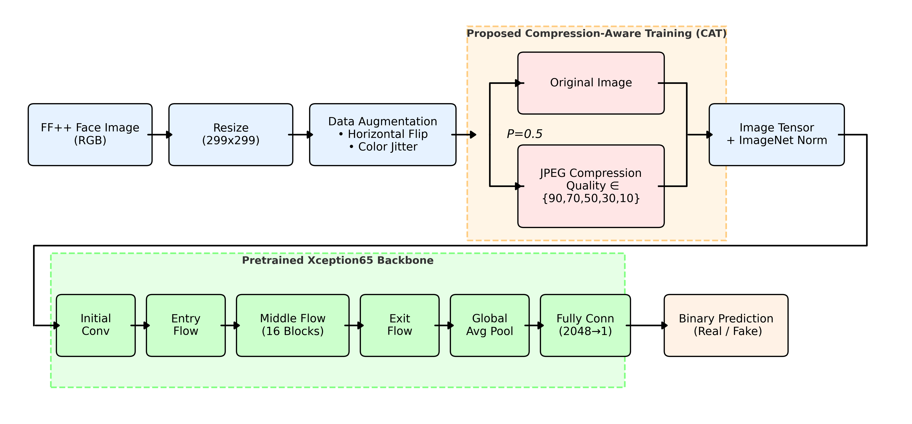
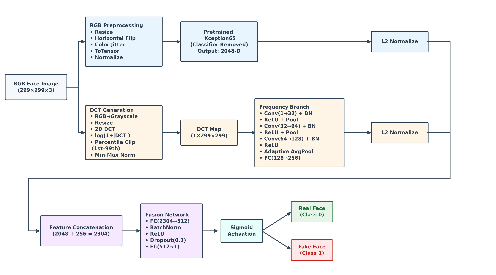
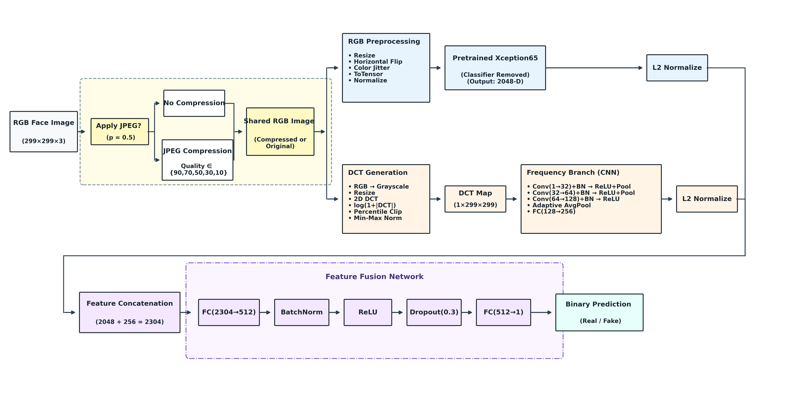

# Robust Deepfake Detection under Compression and Domain Shift

### A Comparative Study of CNN and Transformer Models with Frequency-Aware Learning and Compression-Aware Training

[](https://www.python.org/)
[](https://pytorch.org/)
[](https://colab.research.google.com/)
[](LICENSE)

---

> **Course Project Notice**
>
> This repository contains code and results for the Course Project of the **Deep Learning Spring 2026** course offered at **Information Technology University (ITU), Lahore, Pakistan**.
>
> This repository is intended solely for educational and learning purposes and is **not intended for commercial use**.
>
> **Course Website:** https://im.itu.edu.pk/deeplearning2021/

---

## Project Overview

Deepfake generation techniques have advanced rapidly, making synthetic facial media increasingly difficult to distinguish from authentic content. Although modern deep learning models achieve excellent performance on benchmark datasets, they often fail to generalize across unseen datasets and degrade significantly when images undergo lossy JPEG compression.

This project investigates these challenges by evaluating both convolutional and transformer-based deepfake detectors under **domain shift** and **compression degradation**, followed by two complementary robustness strategies:

- **Architecture-centric robustness** using a **DCT-Aware Xception65** model.
- **Data-centric robustness** using **Compression-Aware Training (CAT)**.

The proposed methods are evaluated on multiple JPEG compression levels and cross-dataset settings to analyze their effectiveness in improving robustness while maintaining strong detection performance.

---

## Objectives

The primary objectives of this project are:

- Evaluate CNN and Transformer architectures for deepfake detection.
- Study cross-dataset generalization from FaceForensics++ to Celeb-DF v2.
- Analyze robustness under multiple JPEG compression levels.
- Design a frequency-aware CNN using DCT features.
- Investigate compression-aware training as a robustness strategy.
- Compare architectural and training-based robustness improvements through comprehensive experiments.

---

## Key Contributions

### Baseline Models

- **Xception65** CNN baseline
- **Vision Transformer (ViT-B/16)** baseline

### Robustness Evaluation

- Cross-dataset evaluation
- JPEG compression robustness analysis
- Multiple compression levels (Clean, Q90, Q70, Q50, Q30, Q10)

### Proposed Methods

- **DCT-Aware Xception65**
  - Incorporates frequency-domain information using Discrete Cosine Transform (DCT) features.

- **Compression-Aware Training (CAT)**
  - Improves robustness by exposing the model to varying JPEG compression levels during training.

- **DCT + Compression-Aware Xception65**
  - Combines frequency-aware learning with compression-aware training.

---

## Repository Structure

```text
MSDS24031_Project_DLSpring2026/
│
├── baselines/
│   ├── xception65/
│   └── vit_b16/
│
├── proposed_methods/
│   ├── dct_xception65/
│   ├── compression_aware_xception65/
│   └── dct_compression_aware_xception65/
│
├── compression_evaluation/
│
├── data_preparation/
│
├── datasets/
│   └── README.md
│
├── checkpoints/
│   └── README.md
│
├── results/
│   └── README.md
│
├── figures/
│
├── requirements.txt
├── requirements_colab.txt
└── README.md
````

---

## Project Workflow

The complete experimental workflow consists of four stages:

```text
Dataset Preparation
        │
        ▼
Baseline Training
(Xception65 & ViT-B/16)
        │
        ▼
Compression Robustness Evaluation
        │
        ▼
Proposed Robustness Methods
(DCT, CAT, DCT + CAT)
```

---

## Datasets

The project is evaluated using two widely adopted deepfake datasets.

| Dataset                | Purpose                                              |
| ---------------------- | ---------------------------------------------------- |
| FaceForensics++ (FF++) | Model training, validation, and in-domain evaluation |
| Celeb-DF v2            | Cross-dataset generalization evaluation              |

JPEG compression experiments are performed using the following quality levels:

* Clean
* Quality 90
* Quality 70
* Quality 50
* Quality 30
* Quality 10

---

## Experimental Pipeline

The overall experimental pipeline consists of:

1. Dataset preparation
2. Face extraction and preprocessing
3. Baseline model training
4. Cross-dataset evaluation
5. JPEG compression robustness evaluation
6. Proposed robustness methods
7. Comparative analysis

The following sections present the proposed architectures, experimental results, and implementation details.

---

# Open in Google Colab

All notebooks can be executed directly in Google Colab.

| Notebook | Open |
| :--- | :--- |
| Xception65 Baseline | [](https://colab.research.google.com/github/mubashar-ds/MSDS24031_Project_DLSpring2026/blob/main/baselines/Xception/Xception65_Baseline_1.ipynb) |
| ViT-B16 Baseline | [](https://colab.research.google.com/github/mubashar-ds/MSDS24031_Project_DLSpring2026/blob/main/baselines/ViT/ViT_B16_Baseline_1.ipynb) |
| DCT-Xception65 | [](https://colab.research.google.com/github/mubashar-ds/MSDS24031_Project_DLSpring2026/blob/main/proposed_methods/DCTAwareXception65.ipynb) |
| Compression-Aware Xception65 | [](https://colab.research.google.com/github/mubashar-ds/MSDS24031_Project_DLSpring2026/blob/main/proposed_methods/CompressionAwareXception65.ipynb) |
| CAT + DCT-Xception65 | [](https://colab.research.google.com/github/mubashar-ds/MSDS24031_Project_DLSpring2026/blob/main/proposed_methods/DctCompressionsAwareXception65.ipynb) |
| Consistency ViT | [](https://colab.research.google.com/github/mubashar-ds/MSDS24031_Project_DLSpring2026/blob/main/proposed_methods/ViT_Robustness.ipynb) |
| Baseline Compression Evaluation | [](https://colab.research.google.com/github/mubashar-ds/MSDS24031_Project_DLSpring2026/blob/main/compressions_evaluations/Baselines_Compressions_Evaluations.ipynb) |
| CAT Compression Evaluation | [](https://colab.research.google.com/github/mubashar-ds/MSDS24031_Project_DLSpring2026/blob/main/compressions_evaluations/CompressionAwareXception65_Compressions_Evaluations.ipynb) |
| DCT Compression Evaluation | [](https://colab.research.google.com/github/mubashar-ds/MSDS24031_Project_DLSpring2026/blob/main/compressions_evaluations/DCTAwareXception65_Compressions_Evaluations.ipynb) |
| DCT_CAT Compression Evaluation | [](https://colab.research.google.com/github/mubashar-ds/MSDS24031_Project_DLSpring2026/blob/main/compressions_evaluations/DctCatAwareXception65_Compressions_Evaluations.ipynb) |


> **Note:**
> These notebooks were developed and executed in Google Colab. Due to a known GitHub rendering limitation with certain Colab widget outputs, some notebooks may display **"Invalid Notebook"** in GitHub's preview. The notebooks themselves are valid and can be opened and executed normally using the **Open in Colab** badges below.

---

---

# Proposed Robustness Methods

This project investigates two complementary strategies for improving the robustness of deepfake detection under JPEG compression:

- **Architecture-centric robustness** through frequency-aware feature learning using Discrete Cosine Transform (DCT).
- **Data-centric robustness** through Compression-Aware Training (CAT).

Their combination is also evaluated to analyze whether architectural and training-based improvements provide complementary benefits.

---

## Proposed Architectures

### Compression-Aware Xception65 (CAT)

<p align="center">
  
</p>

Compression-Aware Training randomly applies JPEG compression with varying quality factors during training, encouraging the model to learn representations that are less sensitive to compression artifacts.

---

### DCT-Aware Xception65

<p align="center">
  
</p>

The proposed DCT-Aware Xception65 introduces a parallel frequency-domain branch that extracts Discrete Cosine Transform (DCT) features. The RGB and frequency representations are fused before classification to exploit complementary spatial and frequency information.

---

### Combined CAT + DCT-Aware Xception65

<p align="center">
  
</p>

The combined model integrates Compression-Aware Training with the DCT-Aware architecture to investigate whether jointly improving data robustness and frequency-aware feature learning leads to further gains under severe JPEG compression.

---

# Experimental Results

## Baseline Performance

| Model | FF++ (Clean) AUC | Celeb-DF v2 (Clean) AUC |
|------|:----------------:|:-----------------------:|
| Xception65 | 0.9547 | 0.7872 |
| ViT-B/16 | 0.8839 | 0.7765 |

**Observation**

- Xception65 achieved the highest in-domain performance on FaceForensics++.
- Both models experienced noticeable performance degradation when evaluated on Celeb-DF v2, highlighting the impact of domain shift.

---

## Proposed Methods Performance

| Model | FF++ (Clean) AUC | Celeb-DF v2 (Clean) AUC |
|------|:----------------:|:-----------------------:|
| DCT-Xception65 | **0.9657** | 0.7885 |
| CAT-Xception65 | 0.9452 | **0.8039** |
| CAT + DCT-Xception65 | 0.9388 | 0.7921 |
| ViT Consistency | 0.8840 | 0.7765 |

## Baselines Compression Robustness Results (AUC)

The following table summarizes the robustness of the baseline models under different JPEG compression levels. ROC-AUC is reported as the primary evaluation metric.

### FaceForensics++

| Model | Clean | Q90 | Q70 | Q50 | Q30 | Q10 |
|------|------:|------:|------:|------:|------:|------:|
| Xception65 | 0.955 | 0.947 | 0.914 | 0.878 | 0.821 | 0.632 |
| ViT-B/16 | 0.884 | 0.884 | 0.881 | 0.873 | 0.871 | 0.814 |

### Celeb-DF v2

| Model | Clean | Q90 | Q70 | Q50 | Q30 | Q10 |
|------|------:|------:|------:|------:|------:|------:|
| Xception65 | 0.787 | 0.784 | 0.781 | 0.748 | 0.697 | 0.559 |
| ViT-B/16 | 0.776 | 0.777 | 0.775 | 0.774 | 0.771 | 0.690 |

**Observations**

- Xception65 achieved the highest performance on clean FaceForensics++ images.
- ViT-B/16 demonstrated substantially better robustness under severe JPEG compression, particularly at **Q10**.
- Cross-dataset evaluation on Celeb-DF v2 remained considerably more challenging than in-domain evaluation on FaceForensics++.
- These findings motivate the proposed robustness methods presented in the following sections.

## Proposed Methods Compression Robustness (AUC)

### FaceForensics++

| Model | Clean | Q90 | Q70 | Q50 | Q30 | Q10 |
|------|------:|------:|------:|------:|------:|------:|
| DCT-Xception65 | 0.966 | 0.959 | 0.937 | 0.900 | 0.833 | 0.646 |
| CAT-Xception65 | 0.945 | 0.929 | 0.944 | 0.925 | 0.894 | 0.784 |
| DCT + CAT Xception65 | 0.939 | 0.934 | 0.931 | 0.915 | 0.888 | 0.791 |
| ViT-Consistency | 0.884 | 0.884 | 0.881 | 0.873 | 0.871 | 0.814 |

### Celeb-DF v2

| Model | Clean | Q90 | Q70 | Q50 | Q30 | Q10 |
|------|------:|------:|------:|------:|------:|------:|
| DCT-Xception65 | 0.789 | 0.788 | 0.783 | 0.752 | 0.698 | 0.553 |
| CAT-Xception65 | 0.804 | 0.801 | 0.797 | 0.785 | 0.761 | 0.684 |
| DCT + CAT Xception65 | 0.792 | 0.781 | 0.785 | 0.774 | 0.756 | 0.689 |
| ViT-Consistency | 0.876 | 0.777 | 0.775 | 0.774 | 0.771 | 0.690 |

### Key Observations

- **DCT-Xception65** achieved the highest performance on clean FaceForensics++ images and provided consistent gains under mild to moderate JPEG compression.
- **Compression-Aware Training (CAT)** substantially improved robustness under stronger compression levels while also achieving the best cross-dataset performance on Celeb-DF v2.
- **DCT + CAT Xception65** achieved the strongest performance under the most severe compression level (**Q10**) on FaceForensics++, indicating improved resilience to heavy JPEG degradation.
- Overall, the proposed methods demonstrate that frequency-aware feature learning and compression-aware training are complementary strategies for improving robustness against image compression.

---

## JPEG Compression Evaluation

Each model was evaluated under six JPEG compression settings.

| Compression Level | Description |
|------------------|-------------|
| Clean | Original images |
| Q90 | Very light compression |
| Q70 | Light compression |
| Q50 | Moderate compression |
| Q30 | Heavy compression |
| Q10 | Severe compression |

The complete quantitative results, ROC curves, confusion matrices, and evaluation metrics are available in the **results/** directory.

---

## Compression Robustness

The robustness analysis evaluates how detection performance changes as JPEG compression becomes increasingly severe.

The following experiments were conducted:

- Xception65
- ViT-B/16
- DCT-Xception65
- Compression-Aware Xception65
- CAT + DCT-Xception65

across

- FaceForensics++
- Celeb-DF v2

under

- Clean
- Q90
- Q70
- Q50
- Q30
- Q10

This provides a comprehensive comparison of model robustness under realistic image degradation.

---

# Key Findings

- Xception65 achieved the strongest in-domain performance on FaceForensics++.
- Performance dropped considerably under cross-dataset evaluation on Celeb-DF v2, demonstrating the impact of domain shift.
- JPEG compression consistently degraded deepfake detection performance across all evaluated models.
- Incorporating DCT-based frequency information improved the CNN baseline under most compression levels.
- Compression-Aware Training improved robustness by exposing the model to multiple JPEG quality levels during training.
- The combined CAT + DCT model was evaluated to investigate the complementary effects of architecture-centric and data-centric robustness strategies.
- The experiments provide a comprehensive comparison between CNN- and Transformer-based approaches for robust deepfake detection under challenging real-world conditions.

---

---

# Installation

## Clone the Repository

```bash
git clone https://github.com/mubashar-ds/MSDS24031_Project_DLSpring2026.git
cd MSDS24031_Project_DLSpring2026
```

---

## Create a Virtual Environment (Optional)

```bash
python -m venv .venv
```

Activate the environment.

### Windows

```bash
.venv\Scripts\activate
```

### Linux / macOS

```bash
source .venv/bin/activate
```

---

## Install Dependencies

For local development (VS Code):

```bash
pip install -r requirements.txt
```

For Google Colab:

```bash
pip install -r requirements_colab.txt
```

---

# Download Required Resources

Large project resources are hosted externally because they exceed GitHub's storage limits.

| Resource | Description |
|----------|-------------|
| **Datasets** | Original and preprocessed datasets |
| **Checkpoints** | Trained model weights |
| **Results** | Evaluation metrics, figures, ROC curves, confusion matrices and CSV files |

Please refer to the corresponding README files for download links and setup instructions:

```text
datasets/README.md

checkpoints/README.md

results/README.md
```

---

# Running the Project

The recommended workflow is:

```text
1. Download datasets
        │
        ▼
2. Download checkpoints
        │
        ▼
3. Install dependencies
        │
        ▼
4. Run notebooks or Python scripts
        │
        ▼
5. Evaluate robustness under compression
```

---

# Requirements

The project has been tested with:

| Component | Version |
|-----------|----------|
| Python | 3.10+ |
| PyTorch | 2.x |
| Torchvision | Latest |
| CUDA | 12.x (recommended) |
| Google Colab | Supported |
| VS Code | Supported |

---

# Reproducibility

The repository provides:

- Source code
- Training notebooks
- Evaluation scripts
- Pretrained checkpoints
- Experimental results
- Dataset preparation scripts

allowing the complete experimental pipeline to be reproduced.

---

---

# License

This project is released under the **MIT License**.

See the [LICENSE](LICENSE) file for details.

---

# Acknowledgements

This project was completed as part of the **Deep Learning Spring 2026** course offered at:

**Information Technology University (ITU), Lahore, Pakistan**

The authors would like to thank the course instructors for their guidance throughout the project.

This work also builds upon publicly available datasets and open-source deep learning frameworks including:

- FaceForensics++
- Celeb-DF v2
- PyTorch
- Torchvision
- timm
- Hugging Face Transformers

---

# Repository Highlights

- CNN and Transformer baseline comparison
- Cross-dataset generalization analysis
- JPEG compression robustness evaluation
- DCT-aware frequency learning
- Compression-Aware Training (CAT)
- Combined CAT + DCT architecture
- Comprehensive ablation study
- Google Colab compatible notebooks
- Complete experimental results and pretrained models

---

# Future Work

Possible future extensions include:

- Evaluation on additional deepfake benchmarks.
- Robustness against diffusion-generated deepfakes.
- Video-level temporal modeling.
- Self-supervised and multimodal deepfake detection.
- Real-world deployment under diverse compression and transmission conditions.

---

# Contact

**Author:** Mubashar Hussain

**GitHub:** https://github.com/mubashar-ds

For questions or suggestions, please open an issue in this repository.

---
